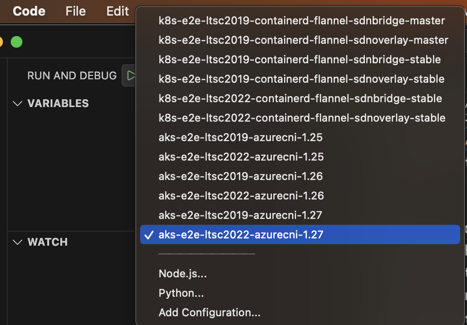
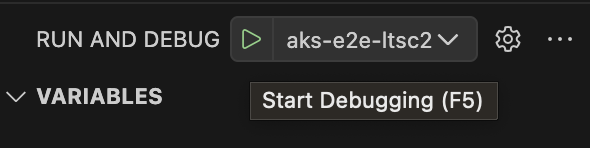
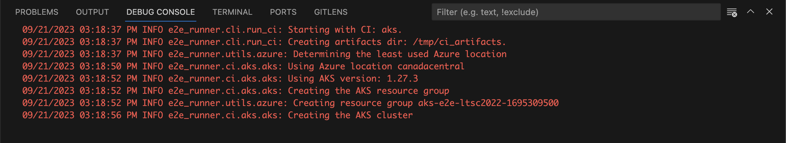

# E2E Runner Debugging

The `e2e-runner` tool can be debugged with Visual Studio code.

## Prerequisites

* [Visual Studio Code](https://code.visualstudio.com/) installed.
* [Docker Engine](https://docs.docker.com/engine/install/) installed.
* Python (3.11 or newer) installed.
* The following VSCode extensions installed:
  * [Python Extension Pack](https://marketplace.visualstudio.com/items?itemName=donjayamanne.python-extension-pack)
  * [Pylance](https://marketplace.visualstudio.com/items?itemName=ms-python.vscode-pylance)
  * [Docker](https://marketplace.visualstudio.com/items?itemName=ms-azuretools.vscode-docker)
* Service Principal (SP) credentials with access to an Azure subscription:
  * This will be used to spawn testing Kubernetes clusters for [end-to-end tests](https://github.com/kubernetes/kubernetes/tree/master/test/e2e#teste2e).

## Debugging

The [GitHub root repository](https://github.com/e2e-win/k8s-e2e-runner) already contains the [.vscode](https://github.com/e2e-win/k8s-e2e-runner/tree/main/.vscode) directory with the necessary configurations to debug the `e2e-runner` tool.

We need to clone the repository and open it with VSCode:

```bash
git clone https://github.com/e2e-win/k8s-e2e-runner.git
cd k8s-e2e-runner
code .
```

Before anything else, we need to setup the debugging environment.

This is done by running the `./e2e-runner/debug/setup-env.sh` script, using the Azure SP creds:

```bash
export AZURE_SUBSCRIPTION_ID="<subscription-id>"
export AZURE_TENANT_ID="<tenant-id>"
export AZURE_CLIENT_ID="<client-id>"
export AZURE_CLIENT_SECRET="<client-secret>"

./e2e-runner/debug/setup-env.sh
```

After running this script, the directory `./e2e-runner/debug/.env` will be created with the necessary files to locally debug the `e2e-runner` tool.

NOTE: The directory `./e2e-runner/debug/.env/ssh` contains the SSH key pair that will be authorized to the testing Kubernetes clusters. This can be used to manually SSH into the testing Kubernetes clusters, for troubleshooting purposes.

Now, we can start debugging the `e2e-runner` tool.

The main entrypoint for the tool is [here](https://github.com/e2e-win/k8s-e2e-runner/blob/1f0a40bb64a057d7b98c415174dbd2aec235b64a/e2e-runner/e2e_runner/cli/run_ci.py#L227-L252). Also, feel free to explore the [codebase](https://github.com/e2e-win/k8s-e2e-runner/tree/1f0a40bb64a057d7b98c415174dbd2aec235b64a/e2e-runner/e2e_runner), and add breakpoints wherever you want.

To start debugging, select `Run and Debug` from the left menu, and then select the desired configuration from the dropdown menu:



After selecting the desired configuration, click on the `Start Debugging` button (or `F5` key):



If everything is properly configured, after the debug container is set by VSCode, the `Debug Console` will start:



Keep in mind that the `e2e-runner` tool will setup resource groups with the testing clusters (as observed in the above `Debug Console`).

These resource groups will be deleted after the tests are finished.

However, if you abruptly stop the debugging session, the resource groups will remain in the Azure subscription, and they need to be manually cleaned up.
