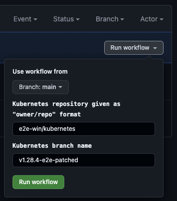
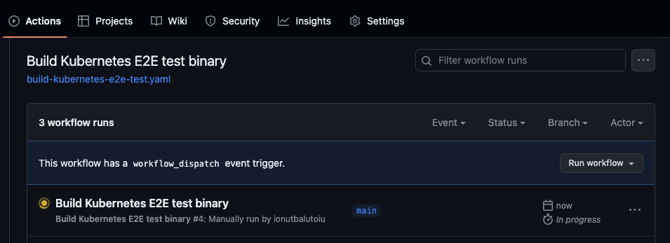
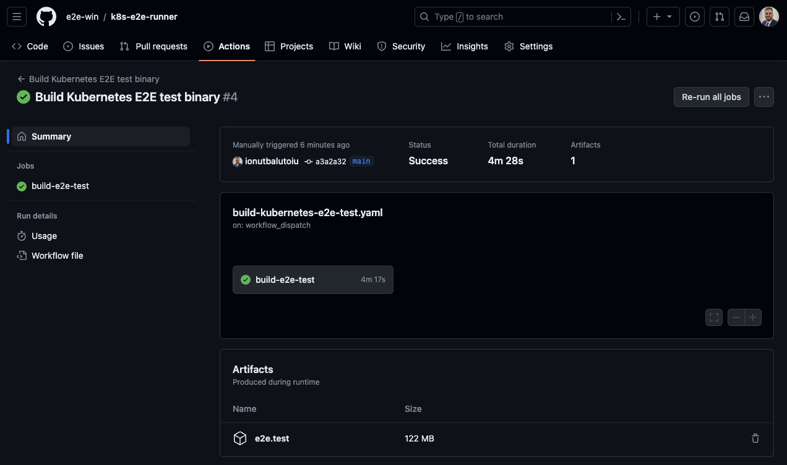

# Custom E2E Test Patches

## Overview

By default, the `e2e-runner` uses the `e2e.test` binary released for the
tested Kubernetes version.

For example, if we are testing `v1.28.4` Kubernetes version, the `e2e.test`
binary used is the one released for `v1.28.4`.

However, sometimes there are fixes to the [kubernetes/test/e2e](https://github.com/kubernetes/kubernetes/tree/master/test/e2e)
codebase. These fixes are initially merged into the Kubernetes repository
`master` branch, before being cherry-picked into the release branches.

There are occasions when we want to use E2E fixes before they are released.
The `e2e-runner` can use custom `e2e.test` binary given via `--e2e-bin`
parameter.

## E2E Test Patches Branches

There is a fork of the Kubernetes repository at [e2e-win/kubernetes](https://github.com/e2e-win/kubernetes). This fork contains branches with the patched Kubernetes releases.

For example, at the moment of this writing, there are the following branches:

```shell
v1.25.15-e2e-patched
v1.26.10-e2e-patched
v1.27.7-e2e-patched
v1.28.4-e2e-patched
```

All of them have fixes that were merged into the Kubernetes repository `master`
branch, but not yet cherry-picked into the release branches.

For example, to create a new patched release branch from `v1.28.5`, we can do
the following:

```shell
# Clone the e2e-win/kubernetes fork
git clone git@github.com:e2e-win/kubernetes.git
cd kubernetes

# Create a new branch from the release "v1.28.5"
git checkout v1.28.5
git checkout -b v1.28.5-e2e-patched

# Cherry-pick the fixes (using commit ID) from the "master" branch
git cherry-pick "<COMMIT_ID_1>"
git cherry-pick "<COMMIT_ID_2>"

# Push the branch to the e2e-win/kubernetes fork
git push origin v1.28.5-e2e-patched
```

The above commands will create a new `v1.28.5-e2e-patched` branch in the
[e2e-win/kubernetes](https://github.com/e2e-win/kubernetes) fork. The new
patched branch will contain the `master` branch fixes from `"<COMMIT_ID_1>"`
and `"<COMMIT_ID_2>"`.

## Build Custom E2E Test Binary

Once we have the Kubernetes release branch patched, we can build the
`e2e.test` binary with:

```shell
CGO_ENABLED=0 make WHAT="test/e2e/e2e.test" KUBE_BUILD_PLATFORMS="linux/amd64"
```

The above command will build the `e2e.test` binary for `linux/amd64` platform,
and the binary will be located at `_output/local/bin/linux/amd64/e2e.test`.

We need to upload the patched binary to a public location (e.g. Azure storage
account), and give its URL to the `--e2e-bin` parameter of the `e2e-runner`
tool.

### Build E2E Test Binary via GitHub Action

In order to simplify the process of building the patched `e2e.test` binary, we
can use [this GitHub action](https://github.com/e2e-win/k8s-e2e-runner/actions/workflows/build-kubernetes-e2e-test.yaml)
from the [e2e-win/k8s-e2e-runner](https://github.com/e2e-win/k8s-e2e-runner)
repository.

This GitHub action is triggered manually, and it saves the `e2e.test` binary as an artifact.

For example, to build the `e2e.test` binary from repo [e2e-win/kubernetes](https://github.com/e2e-win/kubernetes) and branch `v1.28.4-e2e-patched`, we can do the following:

* Click `Run workflow` button on the [GitHub action page](https://github.com/e2e-win/k8s-e2e-runner/actions/workflows/build-kubernetes-e2e-test.yaml), and use the
  following parameters:

  

* Click the green `Run workflow` button to trigger the workflow.

* Refresh the page, and you should see the workflow queued or running already:

  

* Go the workflow run page, wait for it to finish and see the published `e2e.test` artifact:

  

  NOTE: The published artifact is available for maximum 90 days before it gets automatically deleted.

* Click the `e2e.test` artifact. This will download a zip archive with the `e2e.test` binary.

  Extract the zip archive, and upload the `e2e.test` binary to a public web
  server in order to be used with the `--e2e-bin` parameter of the `e2e-runner` tool.
